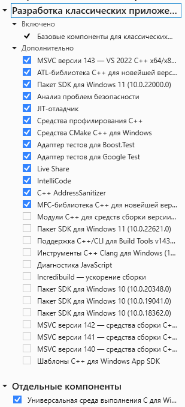

X-Ray OMP Engine x64
==========================
* Движок основан на [STCOP Engine x64](https://github.com/mortany/) и [X-Ray OMP](https://github.com/xray-omp/omp-engine)
* Использованы наработки: [xrMPE (old)](https://github.com/FreeZoneMods/xray16), [Advanced X-Ray](https://github.com/DanceManiac/Advanced-X-Ray-Public), [OpenXRay](https://github.com/OpenXRay/xray-16), [xrOxygen](https://github.com/xrLil-Batya/xray-oxygen), [OGSR Engine](https://github.com/OGSR/OGSR-Engine).

## Инструкция по сборке
* Необходима Visual Studio Community 2022 самой актуальной версии со следующими компонентами:

* ВАЖНО: в пути к исходникам не должно быть русских символов, иначе будут ошибки при сборке.
* Открываем src/xrOMP Engine x64.sln.
* На данный момент работает лишь конфигурация Release|x64, поэтому выбираем именно её.
* Выбираем Сборка -> Собрать решение.

## Изменения
*  Добавлена поддержка погоды из Anomaly
*  Добавлены ImGUI редакторы погоды и UI
*  Обновление оригинальной системы установки аддонов
*  Более стабильный код
*  Полная совместимость с оригинальной системой установки аддонов
*  Сборка движка под 2022 студией
*  Рабочий x64
*  Работающий в релизном режиме настройщик худа для итемов и оружия
*  Возможность управления дальностью отрисовки травы и её высотой
*  Частичное распараллеливание вычислений с помощью tbb
*  Исправленное обрезание камерой худовых оъектов
*  Система инерции by Shoker
*  Улучшенные PiP прицелы
*  Улучшенный скининг by Shoker
*  Настройка материала ингейм https://youtu.be/UD3cSvDMpug
*  Рабочий настройщик положения оружия от третьего лица

## Множество улучшений для оружейной составляющей, а именно
* Поддержка оружейных конфигов и ogf моделей рук из Anomaly и H.A.Z.E | Reloaded
* Поддержка худовых анимаций использования предметов
* Правильная реализация полной-неполной перезарядки
* Возможность использовать отдельную анимацию устранения осечки
* Возможность создавать автоматическое оружие на классе пистолетов
* Множество звуковых фиксов и правок

## Разработчики движка
* [xrLil Batya](https://github.com/xrLil-Batya)
